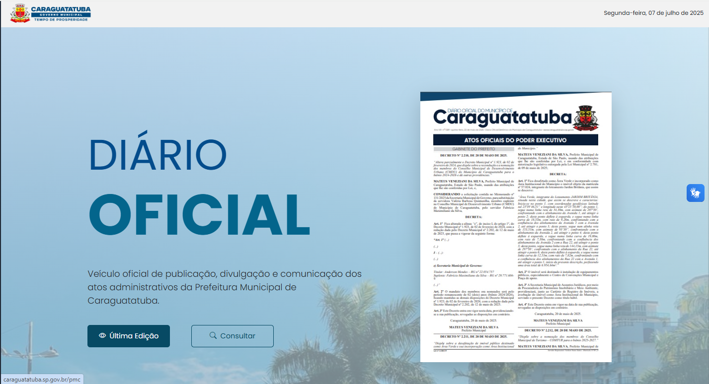
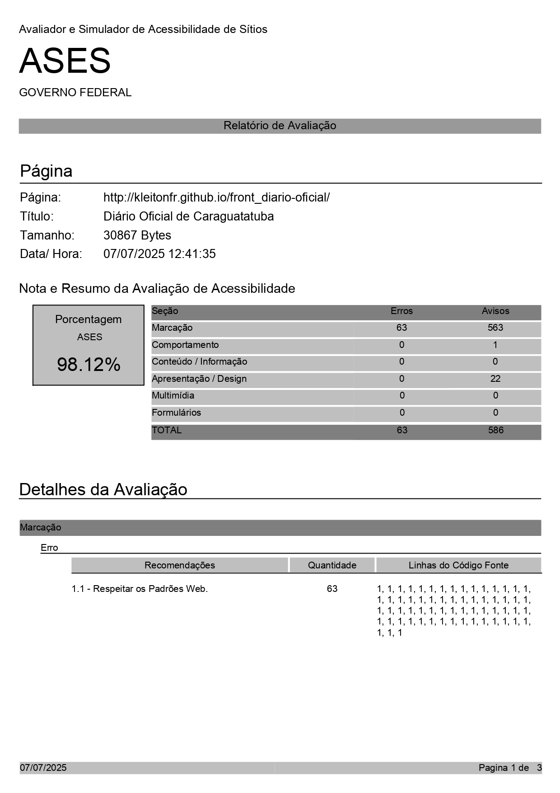

# Diário Oficial - Prefeitura de Caraguatatuba

Nova interface do **Diário Oficial Eletrônico** da Prefeitura Municipal de Caraguatatuba, desenvolvida com foco em modernidade, acessibilidade e experiência do usuário.

> 🔗 Acesse:(https://kleitonfr.github.io/front_diario-oficial/)

---

## 🖼️ Interface

### Página Inicial


### Consulta de edições


### Últimas publicações


---

## 🧰 Tecnologias Utilizadas

- **HTML5 + CSS3**
- **Bootstrap 5.3**
- **JavaScript Vanilla**
- **Bootstrap Icons**
- **VLibras** (acessibilidade em Libras)
- **Google Fonts**
- Design responsivo, acessível e baseado em componentes reutilizáveis.

---

## ♿ Acessibilidade

Este projeto foi avaliado pelo [ASES – Avaliador e Simulador de Acessibilidade de Sítios](https://asesweb.governoeletronico.gov.br/relatorioavaliacao) do Governo Federal com **98,12% de conformidade**.

📄 

**Principais recursos:**
- Compatível com leitores de tela
- Teclado navegável (tabindex, aria-labels)
- Atalhos rápidos por teclado
- VLibras integrado
- Contraste e tamanho da fonte ajustáveis

---

## 🚀 Como Executar

Você pode testar localmente da seguinte forma:

```bash
git clone https://github.com/seu-usuario/front_diario-oficial-master.git
cd front_diario-oficial-master
start index.html
